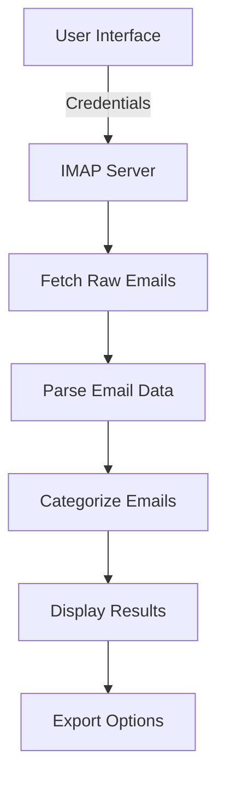
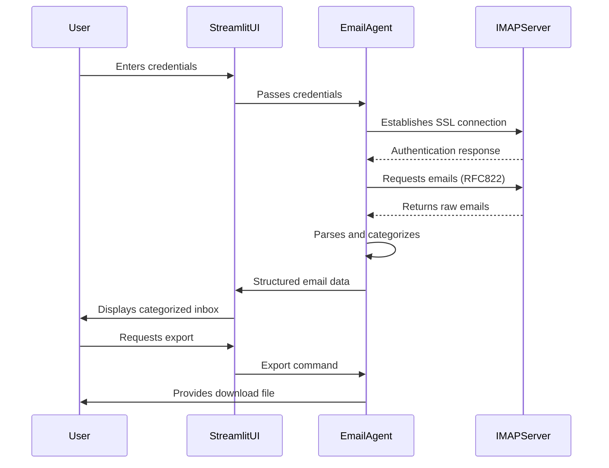

# 📧 Email Reader Agent - README


*(Diagram explanation below)*

## Table of Contents
1. [Project Overview](#project-overview)
2. [Features](#features)
3. [Technical Architecture](#technical-architecture)
4. [Installation](#installation)
5. [Usage](#usage)
6. [Configuration](#configuration)
7. [Workflow Diagram](#workflow-diagram)
8. [Security Considerations](#security-considerations)
9. [Future Enhancements](#future-enhancements)
10. [Troubleshooting](#troubleshooting)

## Project Overview

The Email Reader Agent is a Python application that connects to your email account (Gmail or Outlook), fetches your emails, categorizes them automatically, and presents them in an easy-to-use web interface. It helps you quickly sort through your inbox and identify important messages.

## Features

✅ **IMAP Integration**  
- Supports Gmail and Outlook accounts
- Secure SSL connections
- Fetch up to 100 most recent emails

🔍 **Smart Categorization**  
- Automatic classification into 4 categories:
  - Promotions (offers, deals)
  - Social (social media notifications)
  - Work (job-related emails)
  - Personal (family/friends)
- Uncategorized for emails that don't match any category

📊 **Visual Analytics**  
- Bar chart showing email distribution by category
- Tabular view of recent emails
- Detailed email inspection

💾 **Multiple Export Formats**  
- JSON (structured data)
- CSV (spreadsheet compatible)
- TXT (human-readable format)

## Technical Architecture



Components:
1. **Streamlit Frontend**: Web interface built with Python
2. **IMAP Backend**: Email fetching via imaplib
3. **Processing Engine**: Email parsing and categorization
4. **Export Module**: Data conversion to multiple formats

## Installation

### Prerequisites
- Python 3.8+
- PIP package manager

### Setup Steps

1. Clone the repository:
   ```bash
   git clone https://github.com/muzaffar401/Email_Reader_Agent.git
   cd Email_Reader_Agent
   ```

2. Create and activate virtual environment:
   ```bash
   python -m venv venv
   source venv/bin/activate  # Linux/Mac
   venv\Scripts\activate    # Windows
   ```

3. Install dependencies:
   ```bash
   pip install -r requirements.txt
   ```

4. Create a `.env` file for environment variables (optional):
   ```env
   EMAIL_ADDRESS=your@email.com
   EMAIL_PASSWORD=yourpassword
   ```

## Usage

1. Run the application:
   ```bash
   streamlit run main.py
   ```

2. In your browser:
   - Select email provider (Gmail/Outlook)
   - Enter your credentials
   - Choose how many emails to fetch
   - Click "Fetch Emails"

3. Explore your categorized inbox:
   - View category distribution
   - Inspect individual emails
   - Export results in preferred format

## Configuration

Customize categories by editing the `categories` dictionary in `EmailReaderAgent` class:

```python
self.categories = {
    'Finance': ['bank', 'payment', 'invoice'],
    'Newsletters': ['newsletter', 'subscribe'],
    # Add your own categories here
}
```

## Workflow Diagram



## Security Considerations

🔒 **Important Security Notes**:
- Credentials are only used for the current session
- No email data is stored permanently
- Use app password instead of main password for Gmail
- For Outlook, enable "Allow less secure apps" if needed

Recommended security practices:
1. Use two-factor authentication
2. Create app-specific passwords
3. Revoke access after use
4. Never share your `.env` file

## Future Enhancements

🚀 **Planned Features**:
- [ ] Attachment handling
- [ ] Advanced NLP categorization
- [ ] Email search functionality
- [ ] Scheduled fetching
- [ ] Multi-language support
- [ ] Dark mode UI

## Troubleshooting

Common Issues and Solutions:

1. **Connection Errors**:
   - Verify IMAP is enabled in your email account settings
   - Check for correct server addresses:
     - Gmail: `imap.gmail.com` (port 993)
     - Outlook: `imap-mail.outlook.com` (port 993)

2. **Authentication Failures**:
   - For Gmail: Allow "Less secure app access" or use App Password
   - For Outlook: Check if two-factor authentication is blocking access

3. **Empty Inbox**:
   - Verify you're looking at the correct folder (INBOX)
   - Some providers have separate folders for promotions/social

4. **Performance Issues**:
   - Reduce the number of emails fetched
   - Close other applications using network bandwidth

